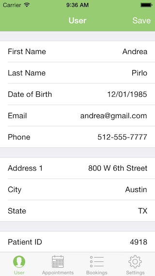

# Doc On Demand

### Introduction

This app was made during the [Athena Health "More Disruption Please" (MDP)](http://mdphackathon.com) Hackathon, held in Austin on the weekend of July 24th - 25th. The event was at Athena Health's office in Austin, inside the former Seaholm Power Plant. There was also a mixer at Capital Factory on Friday July 23rd. 

Like any Hackathon code, this isn't meant to represent a robust production-quality level app. I worked on the app from 2PM Saturday to 10PM, and then from 6AM Sunday to 1PM. So in 15 hours I went from a rough idea to a working solution which interacted with the [Athena Health API](http://www.athenahealth.com/developer-portal) and ran queries against half a dozen endpoints. 

### The App

The App uses a 4-tab TabBar design pattern with User, Appointments, Bookings, and Settings tabs. When first opening the app, a modal view requests the user's details to ensure they match. In practice, the App doesn't actually compare these values though (hey, this is a hackathon !). 

The App is set up for the Demo, with a fixed user selected from a pool of User IDs we created. You can still query and find this user under User Id 4918 on the system, but the appointments seem to have been cleared out. The Practice ID is fixed at 195900, and Department is 145. All these values are set in the Application Delegate at launchtime, this was done with an eye on overriding these values using a Custom URL launcher.

### App UI

For the four tabs:

* The User tab shows the current user information, downloaded from the **/preview1/:practiceid/patients/:patientid** endpoint. We used a user with ID 4918 for the purpose of the Demo. To save time, this user was created with the [Athena IO Docs](https://developer.athenahealth.com/io-docs) web frontend to the API. The User can also be updated by tapping the 'Save' button which does a POST to **/preview1/:practiceid/patients** with the new information.

* The Appointments tab shows all the appointments booked for the current user. This is done using the **/preview1/:practiceid/patients/:patientid/** endpoint, the returned array then populates the UITableView.

* The Bookings uses a UINavigationController pattern to guide the user through the multiple steps of creating an appointment. The first page asks for the Payer and Appointment Type, both of which aren't used in practice. The next screen shows all the appointments available for the fixed department and practice using live data from **/preview1/:practiceid/appointments/open**. The final screen books the appointment using **/preview1/:practiceid/appointments/:appointmentid**.

* The Settings tab is actually empty. I meant to add some debugging and info sections here, but never got around to it.

### App Data Model and Networking

The app uses NSURLSession ephemeral configurations to GET and POST data to the Athena Health API. Luckily the amount of data being returned means a normal NSURLSessionDataTask (storing the JSON returned in memory) can be used. If large amounts of data were being downloaded, an NSURLDownload could be used instead, with a delegate call when the final data was stored in the temporary location.

The UITableViews initially appear empty as data is being requested, a loading UIActivityView here would be a good idea to show the app was actually working on things in the background. But I had a job getting all the features working in time for the Demo, so this was left out.

I also left out the Token request code, as I couldn't get the Basic Authorization working in time. I'm not sure if this is because I wasn't Base64-encoding the strings in the HTTP Request, or some other reason. For the demo I requested a Token from IO Docs, which was valid for an hour, and used that.

### Screenshots

